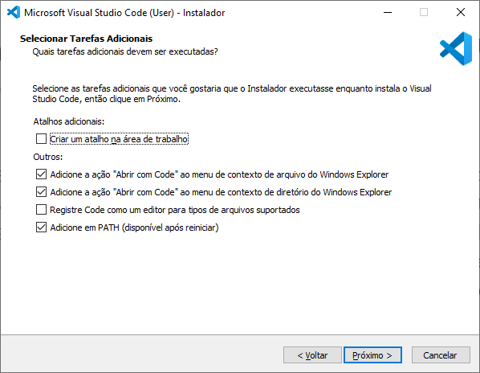

# Configuração do Ambiente

Nesse documento, você encontrará as instruções necessárias para configurar o ambiente Java para o desenvolvimento do projeto.

## Instalação do Java

### Windows

1. Acesse o site do [Adoptium](https://adoptium.net/)
2. Clique no botão "Latest LTS Release" para baixar o instalador da versão mais recente do OpenJDK

Após realizar o download do assistente de instalação basta executa-lo e seguir o processo padrão de instalação de softwares no Windows (next, next, next, finish), com uma única ressalva, tenha certeza que a opção "Set JAVA_HOME variable" esteja habilitada.


Após finalizar o processo de instalação precisamos verificar se a instalação foi realizada com sucesso, para isso abra um terminal (PowerShell ou Prompt) e execute os comandos abaixo:

```bash
java --version
```

e

```bash
javac --version
```

Caso não ocorra nenhum erro após a execução de ambos os comandos acima significa que o processo de instalação do JDK foi realizado com sucesso.

### Linux e macOS

Para realizar a instalação do JDK em sistemas Linux e no macOS nós vamos utilizar uma ferramenta de gerenciamento de versões chamada `SDKMAN!`.

Primeiro precisamos instalar o `SDKMAN!`, para isso execute o comando abaixo:

```bash
curl -s "https://get.sdkman.io" | bash
```

Em seguida execute o comando a seguir:

```bash
source "$HOME/.sdkman/bin/sdkman-init.sh"
```

Para confirmar que a instalação do `SDKMAN!` foi executada com sucesso execute seguinte comando:

```bash
sdk version
```

Caso não seja apresentado nenhum erro significa que a instalação do `SDKMAN!` foi um sucesso!

Um vez que o `SDKMAN!` foi instalado nós podemos utilizar essa ferramenta para realizar a instalação do JDK.

Para realizar a instalação da JDK na versão 17 fornecida pela Amazon execute o comando a seguir:

```bash
sdk install java 17.0.7-amzn
```

E é apenas isso, com o `SDKMAN!` podemos realizar a instalação de uma nova versão do JDK com apenas um comando. Para confirmar que a instalação do JDK realmente foi efetuada com sucesso basta executar os comandos abaixo:

```bash
java --version
```

e

```bash
javac --version
```

Caso não ocorra nenhum erro após a execução dos comandos acima significa que o processo de instalação do JDK foi realizado com sucesso.

## Instalação do Maven

### Windows

Acesse [a página oficial do Maven](https://maven.apache.org/download.cgi) e faça o download dos arquivos binários.


Após realizar o download dos arquivos binários do Maven você deve descompactá-los em um local de sua preferência, importante frisar que o local onde você descompactar os arquivos será o local onde o Maven ficará instalado.

Eu irei descompactar o Maven em `C:\Program Files\Maven\apache-maven-3.6.3`


Agora vem a parte mais complicada do processo de instalação, é necessário colocar o local onde se encontra o script de execução do Maven nas variáveis de ambiente do seu sistema operacional.

Para fazer isso você pode pesquisar por "Editar as variáveis de ambiente do sistema" no menu iniciar e então irá aparecer a seguinte janela:


Clique no botão "Variáveis de ambiente..." e uma janela semelhante à da imagem abaixo irá ser exibida:


Em seguida clique no botão "Novo.." localizado na parte mais inferior da janela, no campo "Nome da variável" coloque "M2_HOME" e no campo "Valor da variável" coloque o caminho para a pasta de instalação do Maven e por fim clique em "OK":


Em seguida clique na variável "Path" localizada na lista de Varáveis do sistema e depois clique no botão "Editar...", em seguida clique no botão "Novo" que está localizado na nova janela que abriu e adicione o caminho  da pasta bin do Maven:


Clique no botão "OK" para fechar a janela "Editar variável de ambiente" e depois clique no "OK" para fechar a janela "Variáveis de Ambiente" e por fim clique no "OK" para fechar a janela "Propriedades do Sistema".

Para verificar se o Maven foi instalado com sucesso abra um terminal (PowerShell ou Prompt) e execute o comando abaixo:

```bash
mvn --version
```

Caso não ocorra nenhum erro após a execução do comando acima significa que o processo de instalação do Maven foi realizada com sucesso.

### Linux e macOS

Para realizar a instalação do Maven em sistemas Linux e no MacOS nós vamos utilizar uma ferramenta de gerenciamento de versões chamada `SDKMAN!`.

Primeiro precisamos instalar o `SDKMAN!`, para isso execute o comando abaixo:

```bash
curl -s "https://get.sdkman.io" | bash
```

Em seguida execute o comando a seguir:

```bash
source "$HOME/.sdkman/bin/sdkman-init.sh"
```

Para confirmar que a instalação do `SDKMAN!` foi executada com sucesso execute seguinte comando:

```bash
sdk version
```

Caso não seja apresentado nenhum erro significa que a instalação do `SDKMAN!` foi um sucesso!

Por fim para realizar a instalação do Maven com o auxílio do `SDKMAN!` basta executar o seguinte comando:

```bash
sdk install maven 3.9.4
```

E é apenas isso, com o `SDKMAN!` podemos realizar a instalação de uma nova versão do Maven com apenas um comando. Para confirmar que a instalação do Maven realmente foi efetuada com sucesso basta executar o comando abaixo:

```bash
mvn --version
```

Caso não ocorra nenhum erro após a execução do comando acima significa que o processo de instalação do Maven foi realizada com sucesso.

## Instalação do VSCode

### Windows

Para instalar o VSCode no Windows, basta acessar o [site oficial](https://code.visualstudio.com/download) e baixar o instalador.

Lembre-se de executar o instalador como administrador e marcar a opção "Adicione em PATH (disponível apos reiniciar)".



### Linux

Para instalar o VSCode no Linux, basta acessar o [site oficial](https://code.visualstudio.com/download) e baixar o instalador para Linux. Ou execute o comando `sudo snap install --classic code` no terminal.

### macOS

Para instalar o VSCode no macOS, basta acessar o [site oficial](https://code.visualstudio.com/download) e baixar o instalador. Aqui basta seguir o assistente de instalação.

## Configuração do VSCode

Para configurar o VSCode, basta instalar as extensões abaixo:

- [Java Extension Pack](https://marketplace.visualstudio.com/items?itemName=vscjava.vscode-java-pack)
- [Spring Boot Extension Pack](https://marketplace.visualstudio.com/items?itemName=Pivotal.vscode-boot-dev-pack)